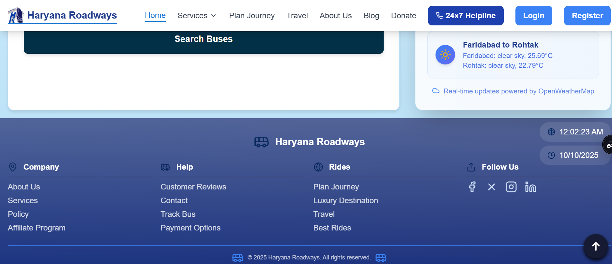
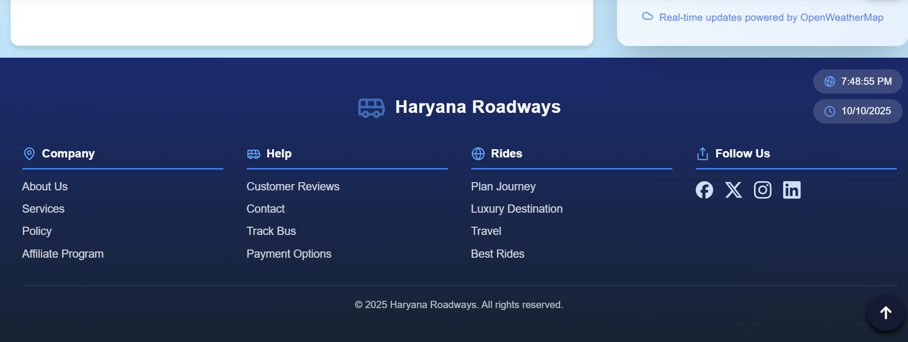

## 📄 Description

Updated social media icons in the footer to use official brand logos instead of generic icons.  
This improves brand recognition and provides a more professional appearance that matches users' expectations.

### 🧭 Expected Behavior

- All social media icons should display their official brand logos
- Facebook should show the official Facebook "f" logo
- X (Twitter) should show the official "X" logo (not a generic cross symbol)
- Instagram should show the official Instagram camera square logo
- LinkedIn should show the official LinkedIn "in" logo
- Icons should be consistent in source and styling

### 🐞 Current Behavior

- Mixed icon sources (some from Lucide React, some from React Icons)
- Twitter icon appeared as a generic cross (✖) instead of the official X logo
- Inconsistent branding that could confuse users
- Non-official representations of social media platforms

### 🪜 Steps to Reproduce

1. Open the website
2. Scroll to the footer
3. Observe the social media icons - they should now show official brand logos
   The Twitter icon in the footer is currently displayed as a cross (✖) instead of the official Twitter (X) logo.  
   This may confuse users, as the icon resembles a “close” or “error” symbol rather than a recognizable social media logo.

### 🧭 Expected Behavior

- The correct Twitter (X) logo should appear, matching Twitter’s current branding.
- The icon should properly link to the project’s Twitter page (if applicable).

### 🐞 Current Behavior

- The Twitter icon appears as a cross (✖) rather than the correct “X” logo.
- The shape and spacing make it look more like a UI element than a social media icon.

### 🪜 Steps to Reproduce

1. Open the website.
2. Scroll to the footer.
3. Observe the Twitter icon — it shows as a cross instead of the correct logo.

---

## 🧩 Related Issue

Closes #614

---

## 📸 Evidence

Before:

After:

### Changes Made:

- **Imports**: Updated from mixed `lucide-react` and `react-icons/si` to all official icons from `react-icons/si`
- **Facebook**: `Facebook` (Lucide) → `SiFacebook` (Official Facebook logo)
- **X (Twitter)**: `XIcon` (Lucide) → `SiX` (Official X logo)
- **Instagram**: Maintained `SiInstagram` (already official)
- **LinkedIn**: `Linkedin` (Lucide) → `SiLinkedin` (Official LinkedIn logo)

### Benefits:

- ✅ Official brand recognition
- ✅ Professional appearance
- ✅ Consistent icon source
- ✅ Brand compliance
- ✅ Future-proof updates

<!-- Add screenshots of before/after UI here -->

- [x] Added relevant screenshots showing the corrected social media icons
- [x] Verified all icon links and hover states
- [x] Confirmed official branding compliance

---

## ✅ TODOs

- [x] Replace generic icons with official brand icons
- [x] Update imports to use consistent icon library (react-icons/si)
- [x] Test icon rendering and functionality
- [x] Verify links still work correctly
- [x] Code review
- [x] Final test verification
- [x] Update documentation if needed
- [x] Confirm deployment

---

## 🔍 Checklist before merging

- [x] My code follows the style guidelines of this project
- [x] I have performed a self-review of my code
- [x] I have commented my code where necessary
- [x] I have made corresponding changes to documentation
- [x] My changes generate no new warnings or errors
